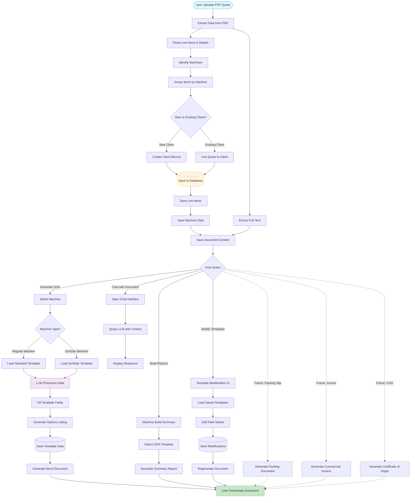

# AI-Powered Document Assistant

This project automates the generation of General Offer Arrangement (GOA) documents from PDF quotes using AI. It streamlines sales and manufacturing workflows by intelligently extracting data, populating templates, and tracking modifications.

## Features
- **Automated Data Extraction:** Parses text and tables from PDF quotes and uses a Large Language Model (LLM) to identify key information.
- **Dynamic Document Generation:** Fills `.docx` templates with extracted data.
- **Modification Tracking:** Allows users to modify and regenerate documents while keeping a history of changes.
- **Web Interface:** A user-friendly interface to manage the entire process.

## How It Works

The system uses PDF quotes to populate documents and build a customer database. The workflow extracts data once for use in multiple document types.



## Getting Started

1.  **Install Dependencies:**
    ```bash
    pip install -r requirements.txt
    ```
2.  **Set Environment Variables:**
    Create a `.env` file and add your `GOOGLE_API_KEY`.
3.  **Initialize Database:**
    ```bash
    python initialize_db.py
    ```
4.  **Run the App:**
    ```bash
    streamlit run app.py
    ```